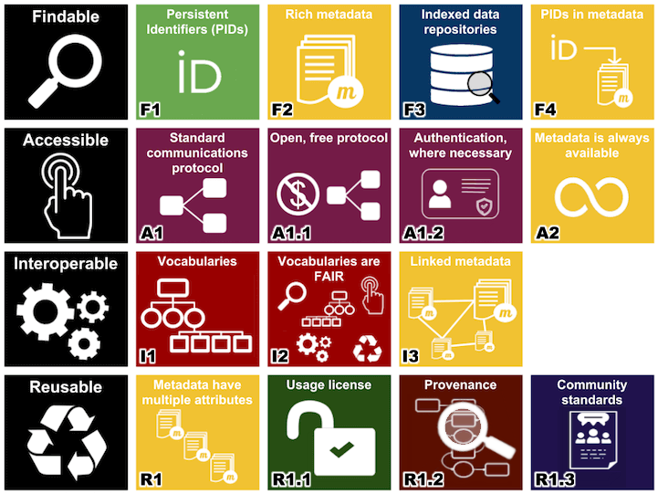
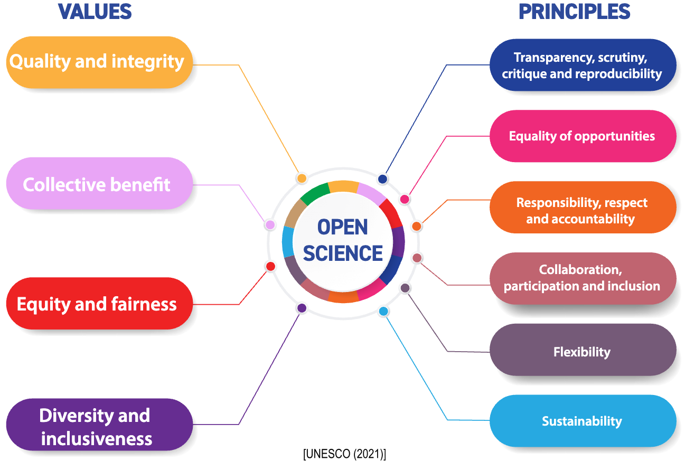
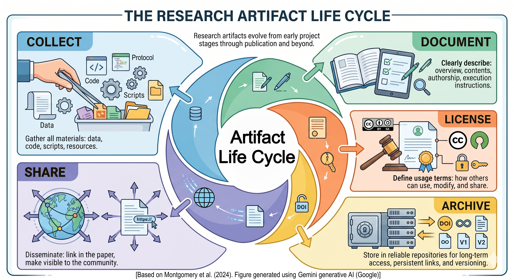

<table style="width: 100%; border-collapse: collapse; border-color: white; margin: auto;">
  <tbody>
    <tr>
      <td style="border: 0px solid white;">← Previous module</td>
      <td style="border: 0px solid white;"><a href="/structure.md">GAPS structure</a></td>
      <td style="border: 0px solid white;"><a href="M2.md">Next module →</a></td>
    </tr>
  </tbody>
</table>

---

<table style="border-collapse: collapse; border-color: white; margin: auto;">
  <tbody>
    <tr>
      <td style="border: 0px solid white;">← Previous module</td>
      <td style="border: 0px solid white; text-align: center; padding: 0 30px;">
        <a href="/structure.md">GAPS structure</a>
      </td>
      <td style="border: 0px solid white;">
        <a href="M2.md">Next module →</a>
      </td>
    </tr>
  </tbody>
</table>

---

  ← Previous module
  &nbsp;&nbsp;&nbsp;&nbsp; | &nbsp;&nbsp;&nbsp;&nbsp; 
  <a href="../structure.md">GAPS structure</a>
  &nbsp;&nbsp;&nbsp;&nbsp; | &nbsp;&nbsp;&nbsp;&nbsp; 
  <a href="M2.md">Next module →</a>

---

<nobr>

← Previous module &nbsp;&nbsp;&nbsp;&nbsp; | &nbsp;&nbsp;&nbsp;&nbsp; 
[GAPS structure](../structure.md) &nbsp;&nbsp;&nbsp;&nbsp; | &nbsp;&nbsp;&nbsp;&nbsp; 
[Next module →](M2.md)

</nobr>

---

# Module 1 - Foundations of research artifacts

# Learning objectives

By the end of this module, participants will be able to:

- Explain what research artifacts are and why they are essential in empirical research.
- Identify and distinguish different types of research artifacts and their roles in the research process.
- Recognize key characteristics of good research artifacts, including usability, reproducibility, and reusability.
- Describe the artifact life cycle and apply it to organize, document, and share research artifacts.

---

Before discussing research artifacts, it is important to first understand the broader context in which they emerge. Artifacts are not an isolated concept; they emerged as a way to complement research communication and address limitations of traditional paper-based scientific publishing.

In this sense, Open Science provides the conceptual foundation that motivates the creation, sharing, and reuse of research artifacts. By understanding Open Science principles, it becomes clearer why artifacts play a central role in improving transparency, reproducibility, and reuse in empirical research.

---

# Open Science
<!-- ZeeReich2018 -- > <!-- MendezEtAl2020 -- > <!-- BeyerWinter2025 -->

The credibility and verifiability of empirical studies in Software Engineering depend strongly on transparency regarding complex artifacts, such as datasets, tools, and experimental setups. Historically, scientific communication was constrained by print-based publication models, which imposed strict limits on space and high dissemination costs. This scenario often led researchers to present summarized methodological descriptions that mask the inherent complexity of the research process, such as intermediate decisions, discarded analyses, or changes in study design.

Today, the global spread of networked technologies has removed these physical barriers, allowing scientific communication to move beyond the static paper and include the sharing of the entire research cycle. In this context, Open Science should not be viewed as a set of universal prescriptions, but as an invitation for researchers to be explicit and honest about their practices. It emerges as a set of practices designed to increase the transparency of evidentiary reasoning and access to research across key stages of the research process.

The transition toward more transparent practices has been gradual and must account for contextual constraints, such as ethical considerations, participant privacy, or the sensitivity of proprietary software data. Ultimately, this movement seeks to improve the quality of scientific dialogue by addressing chronic issues like publication bias and replication failures through increased visibility of the entire research process.

In Software Engineering, these concerns contributed to the emergence of initiatives aimed at improving transparency, reproducibility, and long-term accessibility of research artifacts. One important example is the adoption of artifact evaluation processes by major conferences, encouraging authors to share datasets, tools, scripts, and other materials that support published findings.

The Software Engineering community was among the early adopters of artifact evaluation practices, introducing them even before the magnitude of the reproducibility crisis became widely recognized in many scientific domains. One of the earliest examples occurred at ESEC/FSE 2011, where research artifacts supporting published results were voluntarily submitted for peer review.

## What is Open Science?
<!-- UNESCO2021 - -> <!-- FOSTER2018 - -> <!-- ZeeReich2018 - ->  <!-- MendezEtAl2020 -- > <!-- SonjaEtAl2018 -->

- A set of practices that make the research process and its underlying reasoning more transparent.
- It makes scientific knowledge, data, methods, and processes openly available so that others can access, reuse, and build upon them.
- It promotes collaboration across researchers and society.
- It supports validation, reproducibility, and broader impact of research.
- Open Science also involves advocacy efforts to promote openness, influence policies, and engage stakeholders across the research ecosystem.

Scientific progress depends on research that is reliable, verifiable, and reusable. In this sense, transparency, credibility, and reproducibility are essential foundations for building robust knowledge, particularly in an evolving field such as Software Engineering. Open Science provides the foundation to support these goals.

## Open Science practices

Open Science encompasses a broad and evolving ecosystem of practices, principles, infrastructures, and policies aimed at improving transparency, accessibility, collaboration, and reuse in research.

There are a broader landscape and highlights that Open Science goes far beyond the practices discussed in this module. Since the Open Science ecosystem is extensive, this module focuses on a subset of practices that are more directly connected to research artifacts and reproducibility in empirical Software Engineering research.

This focus does not imply that other Open Science practices are less important. Rather, it reflects the scope and objectives of this material, which emphasize the role of artifacts in supporting transparency, reproducibility, and reuse.

 <!-- GallagherEtAl2020 -->

---

### Open Access

<!-- MendezEtAl2020 -- > <!-- GallagherEtAl2020 -->

**What is it**:
- Scientific publications are made freely available on the public Internet without financial, legal, or technical barriers, allowing anyone to read, download, copy, reuse, distribute, print, search, or link to the full texts of publications for any lawful purpose.

**Why it matters**:
- Open Access increases the visibility and dissemination of research, accelerates knowledge transfer, and reduces inequalities by allowing researchers worldwide to access scientific results regardless of institutional resources.

**Examples in practice**: 
- Publishing papers in open-access venues.
- Depositing preprints in repositories (e.g., arXiv).
- Providing author-accepted manuscripts in institutional repositories.

**Relation to research artifacts**:
- Open Access ensures that the paper describing the artifact is available, enabling others to understand its context, usage, and contributions.

---

### Open Data
<!-- MendezEtAl2020 -- > <!-- ZeeReich2018 -- > <!-- GallagherEtAl2020 -->

**What it is**:
- Data produced during research are made available for access and reuse, typically through public repositories.
- Openness can come in various forms and at different degrees, depending on ethical and legal constraints.
- It includes all data collected or generated during the research, as well as supporting materials, whether quantitative or qualitative.

**Why it matters**:
- Open Data enables validation of results, supports reproducibility, and allows secondary analyses.
- It increases the value of data, which are often costly to collect, and improves the quality of peer review by allowing inspection of underlying evidence.

**Examples in practice**:
- Publishing datasets in repositories (e.g., Zenodo, Figshare).
- Sharing replication packages with raw, processed, and derived data, supporting materials, such as texts, interview transcripts, log data, diaries, and any other materials that were used or produced in a study.
- Providing metadata and data documentation.

**Relation to research artifacts**:
- Open Data corresponds directly to data artifacts, which are central for reproducibility, validation, and reuse.

---

### Open Resources
<!-- UNESCO2021 -- > <!-- GallagherEtAl2020 -- > <!-- SonjaEtAl2018 -->

**What it is**:
- Teaching, learning and research materials in any medium (digital or otherwise) released under an open license that allow no-cost access, use, adaptation and redistribution by others with no or limited restrictions.

**Why it matters**:
- Supports learning, lowers barriers to entry, and broadens access to scientific knowledge.
- Open resources are often built upon research findings, helping disseminate and translate research into reusable educational materials.

**Examples in practice**:
- Sharing tutorials, lecture slides, and teaching materials.
- Publishing guidelines, checklists, and documentation.
- Providing reusable study materials.

**Relation to research artifacts**:
- Open Resources correspond to documentation and communication artifacts, which improve usability, understanding, and learning.
- They support reuse and adaptation, enabling others to build upon and extend research outputs.

---

### Open Source (Open Research Software)
<!-- UNESCO2021 -- > <!-- GallagherEtAl2020 -- > <!-- SonjaEtAl2018 -->

**What it is**:
- Open research software refers to software used in research (e.g., for analysis, simulation, or visualization) or developed as a research output, whose source code is made publicly available.
- It is shared in a user-friendly, human- and machine-readable, and modifiable format, under an open license that allows others to use, study, modify, and redistribute it.

**Why it matters**:
- Open Source in research enables transparency in computational processes, supports reproducibility, and allows others to inspect, reuse, and extend research software.

**Examples in practice**:
- Publishing code on GitHub with an open license.
- Sharing analysis scripts and pipelines.
- Providing executable implementations of algorithms.

**Relation to research artifacts**:
- Open Source corresponds to implementation artifacts, enabling execution and reproduction of results.

 ---

### Open Peer Review
<!-- MendezEtAl2020 -- > <!-- GallagherEtAl2020 -- > <!-- SonjaEtAl2018 -->

**What it is**:
- Open Peer Review is an umbrella term for practices that aim to increase transparency in the peer review process.
  - It may include open identities (authors and reviewers know each other), open reports (reviews are publicly available), and other forms of interaction and participation.
  -  Nowadays, there is yet no commonly accepted and clear definition nor an agreed schema. <!--There is no single universally accepted definition.-->

**Why it matters**:
- Open Peer Review increases transparency and accountability, improves the quality of feedback, and allows broader scrutiny of research, data, and methods.

**Examples in practice**:
- Publishing review reports alongside papers.
- Open discussion between authors and reviewers.
- Community-driven or post-publication review.

**Relation to research artifacts**:
- Open Peer Review increases transparency and enables greater scrutiny of data and methods, which in turn reinforces the need for sharing research artifacts to support verification and reproducibility.

---

### Open Methods
<!-- GallagherEtAl2020 -->

**What it is**:
- Research methods, protocols, and procedures are explicitly documented and shared, enabling others to understand and reproduce the research process.

**Why it matters**:
- Open Methods improve transparency, reduce ambiguity in research design, and support replication by making methodological decisions explicit.

**Examples in practice**:
- Sharing study protocols and experimental designs.
- Providing data collection instruments (e.g., surveys, interview scripts).
- Documenting analysis procedures and decisions.

**Relation to research artifacts**:
- Open Methods correspond to methodological artifacts, which are essential for replication and understanding how results were produced.

---

### FAIR Principles
<!-- MendezEtAl2020 -- > <!-- SonjaEtAl2018 -- > <!-- WilkonsonEtAl2018 -->

**What it is**:
- A set of guiding principles designed to ensure that digital research objects are <u>**F**</u>indable, <u>**A**</u>ccessible, <u>**I**</u>nteroperable, and <u>**R**</u>eusable.

**Why it matters**:
- FAIR principles provide a structured way to improve the quality and reusability of research objects, ensuring that they can be discovered, accessed, integrated, and reused by both humans and machines.
- Making data open does not guarantee reuse. Data must also follow FAIR principles.
  

**Examples in practice**:
- Assigning persistent identifiers (e.g., DOIs).
- Providing rich metadata and documentation.
- Using standard formats and vocabularies.
- Including licenses and provenance information.

**Relation to research artifacts**:
- FAIR principles define the quality attributes of good artifacts, guiding how all types of artifacts should be structured, documented, and shared.

---

#### FAIR-aligned research artifacts

Openness alone does not guarantee that artifacts can be effectively understood, accessed, integrated, or reused. FAIR principles complement Open Science by defining characteristics that make research artifacts more usable and reusable for both humans and machines.

In practice, FAIR-aligned artifacts should be easy to find, access, interpret, connect with other resources, and reuse over time.

##### Findable

Artifacts are assigned persistent identifiers, described with rich metadata, and indexed in searchable resources.

**F1. Assigned a globally unique and persistent identifier (PID)**

- Artifacts should have stable and unique identifiers (e.g., DOI, Handle) that allow them to be reliably referenced, cited, and located over time.

**F2. Described with rich metadata**

- Artifacts should include detailed metadata describing their content, purpose, authorship, structure, context, and usage, making them easier to discover and understand.

**F3. Metadata include the PID of the described object**

- Metadata should explicitly reference the identifier of the artifact they describe, ensuring a clear and unambiguous connection between the artifact and its metadata.

**F4. Registered or indexed in searchable resources**

- Artifacts and their metadata should be deposited in repositories or platforms where they can be searched, discovered, and accessed by others.

---

##### Accessible

Artifacts are retrievable via open, standardized protocols with defined access conditions, and metadata remain accessible even if the data are no longer available.

**A1. Retrievable by their PID using a standardized communication protocol**

- Artifacts should be accessible through stable and standardized mechanisms (e.g., HTTPS, APIs) using their identifiers.

**A1.1. Accessible through open, free, and universally implementable protocols**

- Access protocols should rely on open and widely supported technologies that do not require proprietary tools or restricted implementations.

**A1.2. Support authentication and authorization procedures when necessary**

- When artifacts cannot be fully public (e.g., sensitive or restricted data), access mechanisms should still support controlled and well-defined authorization procedures.

**A2. Metadata remain accessible even if the object is no longer available**

- Even if the artifact itself becomes unavailable, its metadata should remain accessible so others can still understand its existence, context, and characteristics.

---

##### Interoperable

They use shared vocabularies, formal languages, and include links to related data for integration.

**I1. Use formal, accessible, shared, and broadly applicable knowledge representation languages**

- Artifacts should use standardized and broadly supported formats, languages, and representations that facilitate interpretation and integration across tools and systems.

**I2. Use vocabularies that follow FAIR principles**

- Artifacts and metadata should adopt shared vocabularies, taxonomies, or terminologies that are themselves well-documented and reusable.

**I3. Include qualified references to related objects**

- Artifacts should explicitly indicate how they relate to other datasets, scripts, papers, software components, or research outputs, making dependencies and relationships clear.

---

##### Reusable

They are well-described with relevant attributes, include clear usage licenses and provenance, and comply with community standards.

**R1. Richly described with accurate and relevant attributes**

- Artifacts should provide sufficient detail about their content, context, assumptions, limitations, and intended use to support correct interpretation and reuse.

**R1.1. Released with a clear and accessible usage license**

- Artifacts should include explicit licensing information specifying how others may use, modify, and redistribute them.

**R1.2. Associated with detailed provenance**

- Artifacts should document their origin, history, processing steps, versions, and responsible contributors, enabling traceability and trust.

**R1.3. Meet domain-relevant community standards**

- Artifacts should follow conventions, formats, and best practices commonly adopted within the relevant research community or domain.

---

## Practice Open Science sounds like extra work, right?
<!-- FOSTER2018 -->

Practising Open Science may require additional effort, but it brings important benefits.

### For research:
- Supports transparency, validation, and reproducibility.
- Facilitates the reuse of results.
- Accelerates knowledge generation.

### For society:
- Expands access to scientific knowledge.
- Reduces barriers to accessing scientific knowledge, regardless of geographic or economic constraints.
- Increases the return on publicly funded research.

### For researchers:

- Increases visibility and potential impact of their work.
- Creates additional citable outputs (e.g., datasets, code), encouraging reuse.
- Fosters new collaborations and research opportunities.

---

While these benefits highlight why Open Science is valuable, they are rooted in a broader set of values (e.g., quality, equity, collective benefit, and inclusiveness) and principles (e.g., transparency, collaboration, and accountability) that guide Open Science practices. The figure below summarizes these guiding elements.

 <!-- UNESCO2021 -->

To make Open Science practical, researchers rely on research artifacts. These artifacts, such as datasets, code, protocols, and documentation, make it possible to share not only the results of a study, but also the process through which those results were produced. As a result, artifacts are essential for enabling transparency, reproducibility, and reuse in empirical research.

Artifacts are the concrete mechanism through which Open Science becomes actionable in practice, translating abstract principles into tangible and reusable research outputs.

Adoption of open practices may require awareness and cultural change within research communities.

---

# Research Artifacts

In the context of Open Science, sharing only the paper is not enough to fully communicate a study. To make research transparent, reproducible, and reusable, it is necessary to also share the materials that support it. These materials are known as research artifacts.

**What is a research artifact?**

- A research artifact is any external material associated with a research report (e.g., paper).
- It helps others understand, verify, reproduce, or reuse the study. 
- These artifacts are made available via a link within the research report.

Research artifacts are not limited to software. They may include datasets, scripts, documentation, protocols, notebooks, mechanized proofs, models, workflows, and other digital research objects.

**Why do artifacts matter?**

- Research artifacts are essential because they make research transparent and verifiable, allowing others to understand and validate how results were produced.
- They support reproducibility and replicability, enabling studies to be re-executed under the same or similar conditions.
- Artifacts promote reusability and cumulative science, allowing future work to build upon, extend, and compare existing results.

**Formal definition**

More formally, a research artifact can be defined as a digital object generated as a result of the research itself or created by the authors to be used as part of the research, being essential for the associated paper. <!-- ACM2020 TimperleyEtAl2021 -->

# Types of research artifacts

Once we understand what artifacts are, the next step is to understand the different roles they play. They can be grouped into categories based on what they represent and how they contribute to the study.

These categories are not strict or exhaustive, and a single artifact may fit into more than one category. <!-- MenziesEtAl2018 -->

**Overview of artifact types**

1. Conceptual and scientific artifacts
2. Methodological artifacts
3. Data artifacts
4. Implementation artifacts
5. Documentation and communication artifacts
6. Reproducibility and infrastructure artifacts
7. Research outputs as artifacts

Together, these categories reflect the full research lifecycle, from problem definition to execution, communication, and reuse.

The table below presents the definition and role of each artifact category. Rather than memorizing categories, it is more important to understand that artifacts cover the entire research process. The categories below serve as a guide to help you recognize their roles.

Each category reflects a different aspect of the research process, from planning to execution and dissemination.

| Artifact type | Definition | Role |
|---------------|------------|------|
| **1. Conceptual and scientific artifacts** | Artifacts that define, guide, or interpret the research. | Frame the research problem and contribute to scientific knowledge. |
| **2. Methodological artifacts** | Artifacts that describe how the research is conducted. | Enable understanding and replication of the research design. |
| **3. Data artifacts** | Artifacts related to the data used or produced. | Support empirical analysis and validation of results. |
| **4. Implementation artifacts** | Artifacts that operationalize the research. | Enable execution and reproduction of results. |
| **5. Documentation and communication artifacts** | Artifacts that explain how to understand and use the work. | Improve usability, accessibility, and learning. |
| **6. Reproducibility and infrastructure artifacts** | Artifacts that support execution across environments. | Ensure reproducibility and facilitate reuse. |
| **7. Research outputs as artifacts** | Artifacts that are traditionally seen as outputs but can also be reused. | Connect the artifact ecosystem to the published work. |

---

The table below shows examples of the types of research artifacts of each category.

| Artifact type | Examples of artifacts |
|---------------|-----------------------|
| **1. Conceptual and scientific artifacts** | - Motivational or challenge statements  - Hypotheses  - Baseline results  - New findings and results  - Negative results  - Future work directions  - Annotated or structured bibliographies  |
| **2. Methodological artifacts** | - Study instruments (e.g., surveys, interview scripts)  - Study protocols   - Sampling procedures  - Statistical tests and analysis rationale  - Checklists for study design  - Patterns (best practices)  - Anti-patterns (common pitfalls) |
| **3. Data artifacts** | - Raw datasets  - Processed datasets  - Derived datasets  - Data documentation |
| **4. Implementation artifacts** | - Analysis or visualization scripts  - Programs implementing algorithms  - Executable models  - Pipelines and workflows |
| **5. Documentation and communication artifacts** | - README files  - Execution guides  - Tutorials and educational materials  - Commentary on scripts or analysis  - Informative visualizations   - Figures and tables used in the paper |
| **6. Reproducibility and infrastructure artifacts** | - Configuration and dependency files  - Build scripts  - Containerization setups (e.g., Docker)  - Virtual machines or pre-configured environments  - Delivery tools for automated execution |
| **7. Research outputs as artifacts** | - The paper manuscript (which describes the study and references the associated artifacts)   - Supplementary materials   - Figures and Tables |

Research artifacts can range from simple non-executable materials, such as datasets, documentation, and study protocols, to fully executable artifacts, including software systems, automated pipelines, and reproducible environments.

Importantly, artifacts do not need to be complex, exhaustive, or formally evaluated to be valuable. Even relatively small artifacts, such as data used to generate figures, datasets, scripts, or supplementary materials, can significantly improve transparency and understanding beyond what is possible in the paper alone. What matters most is that the artifact is relevant to the study and contributes meaningfully to understanding, verification, reproducibility, or reuse. <!-- ICSE2026 -->

## Execution-oriented vs transparency-oriented artifacts
 <!-- SEFM2024 -->

Research artifacts can also be viewed according to how they support verification, reuse, and reproducibility. Some types of artifacts are primarily designed to support execution and computational reproduction. These artifacts allow users to run software, reproduce analyses, regenerate results, or recreate experimental workflows. Examples include executable scripts, pipelines, notebooks, containers, virtual machines, and automated workflows.

Other artifacts primarily support transparency, inspection, interpretation, and understanding. These artifacts may not be directly executable, but they remain essential for explaining the study design, documenting decisions, clarifying procedures, and enabling critical assessment of the research. Examples include study protocols, interview guides, coding manuals, documentation, figures, methodological descriptions, and qualitative materials.

Many artifacts combine both roles. For example, notebooks may simultaneously document and execute analyses, while datasets may support inspection alone or become executable when integrated into automated pipelines. Importantly, non-executable artifacts are still valuable research artifacts. Transparency, documentation, and contextualization are fundamental components of reproducible and reusable research.

|Artifact example |	Primary role |
| ---- | ---- |
| README |	Transparency-oriented |
| Survey instrument |	Transparency-oriented |
| Interview protocol | Transparency-oriented |
| Dataset | Transparency-oriented or execution-oriented |
| Analysis script | Execution-oriented |
| Jupyter notebook | Both |
| Docker container | Execution-oriented |
| Paper figures | Transparency-oriented |
| Reproduction pipeline | Execution-oriented |

---

# Key characteristics of good research artifacts

Research artifacts do not need to be perfect or exhaustive to be valuable. Even relatively small artifacts, such as the data used to generate figures, can significantly improve transparency and understanding beyond what is possible in the paper alone. At the same time, more comprehensive artifacts, such as complete software systems, replication packages, or executable environments, can further support reproducibility and reuse. What matters most is that the artifact is relevant to the study and contributes meaningfully to understanding, verifying, or extending the research.  <!-- ICSE2026 -->

Instead of thinking in terms of a fixed checklist, it is more useful to understand good artifacts as those that enable understanding, execution, and reuse.

These qualities can be understood through three complementary dimensions, which often overlap in practice.

## Usability

***Can others understand and use it?***

Good artifacts should be understandable and usable without requiring extensive interpretation from the paper authors.

Good artifacts should be:

- **Well-documented**: Artifact documentation should clearly describe its purpose, structure, organization, dependencies, execution process, and expected outputs.

  - In practice: Typical documentation includes README files, execution instructions, metadata, and comments within scripts.

- **Self-contained**: Artifacts should include all necessary components required for understanding and execution, or clearly specify external dependencies and how to obtain them.

  - In practice: Artifacts should include required datasets, scripts, configuration files, dependency versions, environment specifications.

- **Consistent**: Artifacts should remain aligned with the paper and its claims. Inconsistencies between artifacts and the published paper reduce trust and make validation difficult.
  
  - In practice: Align the artifacts with the claims presented in the paper, reported results, execution procedures, figures, and tables.

**Why it matters**: Without usability, even publicly available artifacts may remain impractical to reuse.

## Reproducibility

***Can others run and verify it?***

Good artifacts should allow others to independently execute the research workflow and verify how results were produced. This includes both computational execution and transparency of analytical procedures.

Good artifacts should be:

- **Executable**: Artifacts should run with reasonable effort using the provided instructions and environment specifications.

  - In practice: Researchers should avoid requiring undocumented manual setup, hidden dependencies, inaccessible tools, excessive configuration effort.

- **Automated**: Artifacts should minimize manual intervention whenever possible. Automation reduces human error and improves consistency.

  - In practice: Examples include automated pipelines, scripts for preprocessing and analysis, automatic regeneration of figures and tables, reproducible workflows.

- **Verifiable**: Artifacts should allow others to independently inspect and validate the research process and its outputs. Verifiability helps ensure traceability between raw data, processed data, and reported findings.

  - In practice: Provide access to intermediate outputs, analytical procedures, and generated results for independent validation.

**Why it matters**: Reproducibility is not only about making materials available, but about enabling others to actually re-execute and verify the research process.

## Reusability

***Can others build upon it?***

Well-prepared artifacts may support uses beyond the original study, including secondary analyses, benchmarking, teaching, comparative studies, or integration into future research workflows. Rather than only enabling reproduction of a specific paper, reusable artifacts facilitate adaptation, extension, and long-term reuse in new contexts, datasets, or research questions. <!-- BeyerWinter2025 -->

Good artifacts should be:

- **Legally compliant**: Artifacts should include clear licensing and respect ethical, legal, and privacy constraints. Without clear usage conditions, reuse becomes legally uncertain.

  - In practice: This includes software licenses, data usage permissions, consent restrictions, and third-party dependency compliance.

- **Preserved**: Artifacts should be stored in reliable repositories with long-term access. Temporary or personal hosting solutions may become unavailable over time.

  - In practice: Store artifacts in repositories that support long-term preservation, persistent identifiers, stable access, versioning.

- **FAIR-aligned**: Artifacts should follow FAIR principles, so they can be found, accessed, integrated, and reused. FAIR principles improve both human and machine reuse.

   - In practice: Examples include rich metadata, standardized and interoperable formats, searchable repositories, and explicit relationships between artifacts.

**Why it matters**: Reusability transforms artifacts from supplementary material into durable scientific contributions that can support future research beyond the scope of the original study.

---

# Artifact life cycle
<!-- Montgomery2024 -->

Research artifacts should not be treated as a final step of the research process. Instead, they should evolve alongside the study, from its early stages to publication and beyond.

Thinking in terms of a life cycle helps ensure that artifacts are not only created, but also properly prepared for sharing, reuse, and long-term preservation.

 <!-- Montgomery2024 --> <!-- Gemini2026 -->

A practical way to structure this process is through the following stages:

## 1. Collect

**What to do**:
- Gather all materials produced or used during the research.
- Collection should happen continuously, not only at the end of the project.

**Examples**:
- Data.
- Code.
- Scripts.
- Protocols.
- Any supporting resources.

**Why it matters**: Missing or incomplete materials are one of the main barriers to reproducibility.

## 2. Document

**What to do**:
- Clearly describe the artifact and its contents, so others can understand and use them.

**Examples**:
- Purpose and scope.
- Structure and organization.
- Authorship and contributions.
- Relation to the paper.
- Execution instructions (when applicable).

**Why it matters**: An undocumented artifact is effectively unusable.

## 3. License

**What to do**:
- Define how others can use, modify, and share the artifact.

**Examples**:
- Use appropriate open licenses for:
  - Code (e.g., MIT, Apache)
  - Data (e.g., CC-BY)

**Why it matters**: Without a clear license, reuse is legally uncertain.

## 4. Archive

**What to do**:
- Store artifacts in reliable repositories that support:
  - Long-term preservation.
  - Persistent identifiers (e.g., DOI).
  - Versioning.

**Why it matters**: Personal websites and temporary links are not reliable for long-term access.

## 5. Share

**What to do**:
- Make artifacts visible and accessible to the research community.
- Link the artifacts directly in the paper.
- Use other dissemination channels.

**Why it matters**: Artifacts only contribute to science if others can find and access them.

---

## Continuous process

Although presented as stages, this process is iterative. Artifacts are refined over time, especially after feedback, reuse, or replication attempts.

---

# Key takeaways

- Open Science needs artifacts.
- Artifacts support transparency and reproducibility.
- Good artifacts are usable, reproducible, reusable.
- Artifact preparation is iterative.
- Artifacts should evolve throughout the project.
- Feedback and reuse improve artifacts.
- Good artifacts should work independently of the paper.

---

# Supplementary material of the module

- [Module 1 presentation](https://docs.google.com/presentation/d/1UEMahinOvRuY6Fd-QV9TKlpxhPGo29Hm7QrBSv7etaQ/edit?usp=sharing) <!--Depois vou colocar o slide em ppt na pasta do módulo e mudar esse link aqui para o arquivo estático-->

- [Glossary of terms](/glossary.md)

- [Shared references used across modules](/references.md)

---

<!-- Vai ser removido na versão final. Serve apenas para uma melhor observação da estrutura do módulo -->
- [Module 1 - Foundations of research artifacts](#module-1---foundations-of-research-artifacts)
- [Learning objectives](#learning-objectives)
- [Open Science](#open-science)
  - [What is Open Science?](#what-is-open-science)
  - [Open Science practices](#open-science-practices)
    - [Open Access](#open-access)
    - [Open Data](#open-data)
    - [Open Resources](#open-resources)
    - [Open Source (Open Research Software)](#open-source-open-research-software)
    - [Open Peer Review](#open-peer-review)
    - [Open Methods](#open-methods)
    - [FAIR Principles](#fair-principles)
      - [FAIR-aligned research artifacts](#fair-aligned-research-artifacts)
        - [Findable](#findable)
        - [Accessible](#accessible)
        - [Interoperable](#interoperable)
        - [Reusable](#reusable)
  - [Practice Open Science sounds like extra work, right?](#practice-open-science-sounds-like-extra-work-right)
    - [For research:](#for-research)
    - [For society:](#for-society)
    - [For researchers:](#for-researchers)
- [Research Artifacts](#research-artifacts)
- [Types of research artifacts](#types-of-research-artifacts)
- [Key characteristics of good research artifacts](#key-characteristics-of-good-research-artifacts)
  - [Usability](#usability)
  - [Reproducibility](#reproducibility)
  - [Reusability](#reusability)
- [Artifact life cycle](#artifact-life-cycle)
  - [1. Collect](#1-collect)
  - [2. Document](#2-document)
  - [3. License](#3-license)
  - [4. Archive](#4-archive)
  - [5. Share](#5-share)
  - [Continuous process](#continuous-process)
- [Key takeaways](#key-takeaways)
- [Supplementary material of the module](#supplementary-material-of-the-module)

<!-- --
## Practical example

This example is based on a real research artifact developed in a study analyzing the evolution of artifact calling (i.e., how venues encourage or require artifact sharing) and artifact sharing practices in papers published at ICSE and FSE over a decade.

The artifact supports a full empirical study and enables the reproduction of all reported results.

Artifacts in this project include:

- **Curated dataset of collected papers**
(e.g., list of ICSE and FSE papers with identifiers, titles, and publication years)

- **Processed dataset**
(e.g., structured dataset with extracted variables such as artifact links, availability status, badges, and derived metrics)

- **Extracted data from conference websites**
(e.g., calls for papers, artifact evaluation policies, and historical changes over time)

- **Data extraction protocol**
(e.g., procedures used to collect and classify data from papers and websites)

- **Classification schemes** 
(e.g., artifact availability categories, platform types, disclosure statements)

- **Analysis scripts**
(e.g., R scripts that automatically generate all figures and tables reported in the paper)

- **Results and visualizations**
(e.g., timelines, distributions, and statistical analyses such as correlations)

- **Reproducibility package**
(e.g., organized folder structure with scripts, data, and outputs, enabling one-command execution)

- **Documentation**
(e.g., README files describing the dataset, scripts, and step-by-step reproduction instructions)

This example illustrates how the concepts presented in this module come together in practice and how different types of artifacts (data, code, documentation, and infrastructure) are combined to support transparency, reproducibility, and reuse in empirical research.
-->