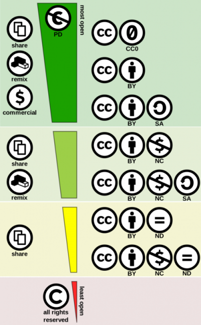

# Choosing appropriate licenses
<!-- https://arxiv.org/pdf/1904.06499 p.18 -->

If you want to share your data you must choose the appropriate license to them.First of all, think about who owns the data? A research funder or an institution that you work for. Then, think about authorship. Applying a suitable license to your data is crucial in order to make them reusable, because licenses define how research artifacts can be used, modified, and shared by others. <!-- SonjaEtAl2018 -->

## Why licensing matters

Open content is not the default. Without an explicit license, others may not legally reuse or modify a research artifact. Choosing an appropriate license is therefore essential when sharing research outputs. However, a common pitfall while starting to use open science practices is to assign unsuitable licenses, which can lead to problems later. <!-- MendezEtAl2020 Klimpel2013-->

An unsuitable license may:

- Restrict how others can reuse the artifact.
- Reduce flexibility for future publication.
- Create incompatibilities with publishers.

For this reason, licensing should be considered early, but decided strategically, taking into account the intended publication venue.

## Types of licenses

The following licenses are among the most commonly used for research artifacts in Software Engineering. They differ mainly in how permissive they are and whether they require derivative works to remain open.

- The [MIT License](https://choosealicense.com/licenses/mit/) is a highly permissive open-source license that allows reuse, modification, and distribution with minimal restrictions, requiring only attribution and inclusion of the original license.

- The [Apache License 2.0](https://choosealicense.com/licenses/apache-2.0/) is a permissive license similar to MIT, but with additional protections, including an explicit grant of patent rights and requirements to include prominent notices stating that files have been modified.

- **GNU General Public License (GPL family)** licenses are copyleft licenses that require derivative works to be distributed under the same license and with source code availability:
  - [GNU GPLv3](https://choosealicense.com/licenses/gpl-3.0/): Requires that modified and distributed versions remain open and licensed under GPL.
  - [GNU LGPLv3](https://choosealicense.com/licenses/lgpl-3.0/): A weaker version of GPL, allowing the licensed component to be linked with proprietary software (e.g., as a library), while still requiring modifications to the component itself to remain open.
  - [GNU AGPLv3](https://choosealicense.com/licenses/agpl-3.0/): Extends GPL by requiring source code disclosure even when the software is used over a network (e.g., web services).

- [Creative Commons](https://creativecommons.org/licenses) are a family of licenses designed for non-software artifacts (e.g., text, datasets, and documentation), allowing creators to define how their work can be reused, shared, and adapted.

These licenses can be categorized as:

**Software licenses**: Licenses designed for software. They are not recommended for non-software artifacts.
  - Examples:
    - Source code and software artifacts
    - Scripts, tools, and analysis pipelines
    - Implementations of algorithms
    - Research prototypes

**Content licenses**: Licenses designed for non-software artifacts. Using software licenses for these materials is generally discouraged as they lack specific clauses for intellectual property in creative works.
- Examples:
  - Datasets
  - Documentation
  - Reports

Choosing between software and content licenses is the first and most important decision.

## License comparison

### Software licenses

The table below summarizes the main permissions, conditions, and limitations of widely used open-source software licenses, based on standardized definitions. <!-- https://choosealicense.com/licenses/ -->

| Feature / License | MIT | Apache 2.0 | GPLv3 | LGPLv3 | AGPLv3 |
|:-----------------|:---:|:----------:|:-----:|:------:|:------:|
| **Type** | Permissive | Permissive | Copyleft | Weak copyleft | Strong copyleft |
| **Commercial use allowed**   The licensed material and derivatives may be used for commercial purposes. | ✅ | ✅ | ✅ | ✅ | ✅ |
| **Modification allowed**   The licensed material may be modified. | ✅ | ✅ | ✅ | ✅ | ✅ |
| **Distribution allowed**   The licensed material may be distributed. | ✅ | ✅ | ✅ | ✅ | ✅ |
| **Private use permission**   The licensed material may be used and modified in private. | ✅ | ✅ | ✅ | ✅ | ✅ |
| **Patent use permission**   Provides an express grant of patent rights from contributors. | ❌ | ✅ | ✅ | ✅ | ✅ |
| **Must disclose source**   Source code must be made available when the licensed material is distributed. | ❌ | ❌ | ✅ | ✅ | ✅ |
| **Same license required**   Modifications must be released under the same license when distributing the licensed material. | ❌ | ❌ | ✅ | ⚠️ | ✅ |
| **Network use triggers source disclosure**   Users interacting over a network must be able to access the source code (AGPL).| ❌ | ❌ | ❌ | ❌ | ✅ |
| **State changes required**   Changes made to the licensed material must be documented. | ❌ | ✅ | ✅ | ✅ | ✅ |
| **Include license and copyright notice**   A copy of the license and copyright notice must be included. | ✅ | ✅ | ✅ | ✅ | ✅ |
| **Warranty limitation**   The license provides the material "as is" without warranty. | ✅ | ✅ | ✅ | ✅ | ✅ |
| **Liability limitation**   The license limits liability of the authors. | ✅ | ✅ | ✅ | ✅ | ✅ |
| **Trademark rights granted**   The license grants rights to use trademarks. | ❌ | ❌ | ❌ | ❌ | ❌ |
| **Recommended for Open Science** | ⭐⭐⭐⭐ | ⭐⭐⭐⭐ | ⭐⭐ | ⭐⭐⭐ | ⭐ |
|**Table Legend**:   ✅ Yes;  ❌ No; ⚠️ Partial**¹**. | | | | | 
 
**¹** In some cases a similar or related license may be used, or this condition may not apply to works that use the licensed material as a library.

---

### Content licenses

Creative Commons licenses are a set of standardized, publicly available licenses primarily used for non-software artifacts (e.g., text, data, and educational materials). They define how others can use, share, and adapt the artifacts.

In addition to the six standard Creative Commons licenses, there is an additional legal tool called CC0 (CC zero). CC0 is a public domain dedication (not a license), which allows creators to waive their rights and maximize reuse.

The elements of Creative Commons licenses define how the artifact can be used.

| CC element | Meaning |
| :--------: | ------- |
|  | Indicates that the work is licensed under a Creative Commons license. |
|  | **Attribution (BY):** Requires giving appropriate credit to the creator, providing a link to the license, and indicating if changes were made. |
|  | **ShareAlike (SA):** Requires that adaptations be distributed under the same or a compatible license. |
|  | **NoDerivatives (ND):** Does not allow distribution of modified versions of the work. |
|  | **NonCommercial (NC):** Restricts use of the work to noncommercial purposes only. |
|  | **Public Domain (CC0):** Waives copyright and related rights, allowing unrestricted use, modification, and distribution, including for commercial purposes, without requiring attribution.|

Instead of analyzing licenses through a single "openness level", it is often more useful to compare them across key dimensions such as attribution, commercial use, and permission to modify the work.

The table below summarizes the main differences between Creative Commons licenses and CC0. The “Most suitable for Open Science” column reflects how well each license supports reuse, modification, and integration of research artifacts.

<!--
| Feature /   License | [**CC0**](https://creativecommons.org/publicdomain/zero/1.0/)    | [**CC BY**](https://creativecommons.org/licenses/by/4.0/)    | [**CC BY-SA**](https://creativecommons.org/licenses/by-sa/4.0/)    | [**CC BY-ND**](https://creativecommons.org/licenses/by-nd/4.0/)    | [**CC BY-NC**](https://creativecommons.org/licenses/by-nc/4.0/)    | [**CC BY-NC-SA**](https://creativecommons.org/licenses/by-nc-sa/4.0/)    | [**CC BY-NC-ND**](https://creativecommons.org/licenses/by-nc-nd/4.0/)    |
|:-----------------|:---:|:-----:|:--------:|:--------:|:--------:|:-----------:|:-----------:|
| **Attribution required** | ❌ | ✅ | ✅ | ✅ | ✅ | ✅ | ✅ |
| **Commercial use allowed** | ✅ | ✅ | ✅ | ✅ | ❌ | ❌ | ❌ |
| **Modifications allowed** | ✅ | ✅ | ✅ | ❌ | ✅ | ✅ | ❌ |
| **ShareAlike required** | ❌ | ❌ | ✅ | ❌ | ❌ | ✅ | ❌ |
| **Most suitable for Open Science** | ⭐⭐⭐⭐ | ⭐⭐⭐⭐ | ⭐⭐⭐ | ⭐ | ⭐ | ⭐ | 🚫 |
Table Legend:   ✅ Yes;  ❌ No.
| | | | | | | | | -->

| License | Attribution required | Commercial use allowed | Modifications allowed | ShareAlike required | Most suitable for Open Science |
|:--------:|:--------------------:|:----------------------:|:---------------------:|:-------------------:|:------------------------------:|
| [**CC0**](https://creativecommons.org/publicdomain/zero/1.0/)    | ❌ | ✅ | ✅ | ❌ | ⭐⭐⭐⭐ |
| [**CC BY**](https://creativecommons.org/licenses/by/4.0/)    | ✅ | ✅ | ✅ | ❌ | ⭐⭐⭐⭐ |
| [**CC BY-SA**](https://creativecommons.org/licenses/by-sa/4.0/)    | ✅ | ✅ | ✅ | ✅ | ⭐⭐⭐ |
| [**CC BY-ND**](https://creativecommons.org/licenses/by-nd/4.0/)    | ✅ | ✅ | ❌ | ❌ | ⭐ |
| [**CC BY-NC**](https://creativecommons.org/licenses/by-nc/4.0/)    | ✅ | ❌ | ✅ | ❌ | ⭐ |
| [**CC BY-NC-SA**](https://creativecommons.org/licenses/by-nc-sa/4.0/)    | ✅ | ❌ | ✅ | ✅ | ⭐ |
| [**CC BY-NC-ND**](https://creativecommons.org/licenses/by-nc-nd/4.0/)    | ✅ | ❌ | ❌ | ❌ | 🚫 |

**Table Legend**: ✅ Yes; ❌ No.

---

As shown above, Creative Commons provides a range of licenses that grant different levels of permission for using, sharing, and adapting a work. All of these licenses offer more flexibility than traditional "all rights reserved" copyright.

To better illustrate how these permissions vary, the image below presents the Creative Commons License Spectrum, highlighting the progression from more open to more restrictive licenses.

 <!-- https://creativecommons.org/public-domain/freeworks/ -->

The comparison above highlights the key trade-offs between licenses. The next step is to translate these differences into practical decisions when selecting a license for research artifacts.

## Choosing the right license

License selection is a strategic decision, not a purely administrative one. It should balance:

- **Type of artifact** (e.g., dataset, documentation, educational material)
- **Author recognition** (need for attribution and academic credit)
- **Compatibility with publication requirements** (interoperability with other artifacts and licenses and compatibility with the license of your paper)

Making an informed choice helps ensure that artifacts remain usable, reusable, and compatible throughout their lifecycle. When selecting a license, researchers should explicitly consider the level of openness they intend to provide and its implications for reuse and interoperability.

Restrictive licenses may limit reuse and integration with other artifacts.

#### Software licenses

- Permissive licenses (MIT, Apache) maximize reuse and flexibility  
- Copyleft licenses (GPL family) ensure that derivatives remain open  
- Strong copyleft (AGPL) may limit adoption in some contexts  

**Note on Open Science:** Be cautious with strong copyleft licenses. Consider compatibility and integration constraints before using strong copyleft licenses.

**Practical recommendation:**
- Prefer **MIT or Apache 2.0** for broad reuse and adoption.
- Choose **GPL/AGPL** when openness of derivatives is a requirement.

#### Content licenses

CC0 is the most permissive option available. It is particularly suitable for research datasets, metadata, and materials intended for unrestricted reuse. However, researchers should be aware that attribution is not legally required (although it is still encouraged as a scholarly norm) and it may not be appropriate when credit attribution is important.

**Note on Open Science:** Licenses that restrict reuse (e.g., NC or ND clauses) may hinder reproducibility and reuse of research artifacts. Whenever possible, prefer more permissive licenses such as CC BY or CC0.

**Practical recommendation:**
- Use **CC0** for datasets and metadata when possible
- Use **CC BY** for most research artifacts
- Avoid **NC** and **ND** clauses if reuse and reproducibility are goals

### Choosing licenses by artifact type

After selecting the appropriate license type (software or content), the next step is to refine the choice based on the specific artifact.

Different types of research artifacts have different reuse requirements. Therefore, license selection should consider how the artifact is expected to be reused (e.g., modified, redistributed, integrated, or cited).

Once this distinction is clear, the next step is to select a license based on the type of research artifact and its intended reuse.

| Artifact type | Recommended license | Key rationale |
|---------------| :------------: |------|
| 1. Conceptual and scientific artifacts | CC BY | Ensures your ideas and findings are widely cited without creating barriers to scientific evolution. |
| 2. Methodological artifacts | CC BY or CC BY-SA | Research instruments (surveys/checklists) need to be adaptable. CC BY allows others to translate or adapt your tools while giving you credit. |
| 3. Data artifacts | CC0 or CC BY | Many repositories suggest CC0 for raw data to facilitate automated meta-analyses. If dataset authorship is a matter of academic record, use CC BY. |
| 4. Implementation artifacts | MIT or Apache | Analysis scripts and algorithms should be easy to run. Use MIT (for simplicity) or Apache 2.0 (for legal robustness). Apache 2.0 is excellent if your algorithm is a patentable innovation. |
| 5. Documentation and communication artifacts | 1 - CC BY   2 - MIT | 1 - If the documentation is a long manual (PDF/Markdown), use CC BY.   2 - If it consists of in-code comments or technical READMEs, they usually follow the code's license (e.g., MIT). |
| 6. Reproducibility and infrastructure artifacts | MIT | Configurations (Docker, YAML, build scripts) are utilities. It is best not to "lock" these files with restrictive licenses; MIT allows anyone to deploy your infrastructure without legal friction. |
| 7. Research outputs as artifacts | CC BY | It ensures the dissemination of the paper text and supplementary materials. |

- This makes your artifact easier to use and more likely to function in the long term (since all required sub-artifacts are packaged internally).
  - However, if applying the correct licenses is too complex or is simply not understood for a particular situation, the easier solution is to not include any third-party content in your artifact. Instead, include links to obtain that content, and/or write build scripts (E.g. MAKE files) that automatically download and integrate the dependencies (such as “requirements.txt” for Python).

**Paper license (part of category 7)**
- The copyright license applied to your paper is already decided through the copyright agreement with the publisher (IEEE, ACM, Elsevier, etc).
- You should understand your rights over your work, particularly across the different versions of your paper ("author-submitted paper", "accepted paper", "final published version", etc.).
- To check the attributed license, go directly to the website of the publisher of your paper (e.g. IEEE, ACM, Elsevier, etc) or visit [Sherpa](https://openpolicyfinder.jisc.ac.uk/), a tool to check compliance to publisher copyright models.

**Third-party materials**
- With regard to use of third-party libraries in your own work, you must respect and apply the appropriate licenses to reuse artifacts that are already licensed by third parties.
- The option most in alignment with Open Science principles is to include third-party dependencies (artifacts) directly in your artifact package, as long as:
  1. their license allows this behavior, and 
  2. you follow the additional rules required by the license (e.g. putting a copy of their license next to their content, mentioning the authors’ names, etc.). 
  
- When choosing a license for Category 6 artifacts (Infrastructure), you must check if the tools being "containerized" (such as proprietary libraries or specific software) allow for such redistribution. The license for the infrastructure artifact covers your configuration scripts, not necessarily everything inside the container.

## Licenses and dependencies
<!-- https://opensource.guide/legal/ -->

Your project very likely has (or will have) dependencies, each of which will have its own open source license with terms you have to respect. For example, if you’re open sourcing a Node.js project, you’ll probably use libraries from the Node Package Manager (npm).

Dependencies with permissive licenses like MIT, Apache 2.0, ISC, and BSD allow you to license your project however you want.

Dependencies with copyleft licenses require closer attention. Including any library with a “strong” copyleft license like the GPLv2, GPLv3, or AGPLv3 requires you to choose an identical or compatible license for your project. Libraries with a “limited” or “weak” copyleft license like the MPL 2.0 and LGPL can be included in projects with any license, provided you follow the additional rules they specify.

Dependencies with source-available licenses, such as the Business Source License BSL or the Server Side Public License SSPL, may appear to be under open source licenses but come with usage and business model restrictions. These restrictions may prevent your project from being considered Open Source as defined by the Open Source Initiative (OSI).

Projects often rely on non-source code content, such as images, icons, videos, fonts, data files, or other materials, which are governed by their own licenses. As with traditional software dependencies, the licenses these materials range from Commercial to permissive to Copyleft. The Creative Commons, a non-profit organization, created a series of licenses popular for non-source content. Creative Commons licenses range from very permissive CC0 to Permissive CC-BY to copyleft CC-SA. They also can sometimes restrict commercial use by adding a non-commercial (NC) option to these licenses. 

Choosing an appropriate license is not only a legal decision, but also a scientific and strategic one, as it directly influences the visibility, reuse, and impact of research artifacts.

