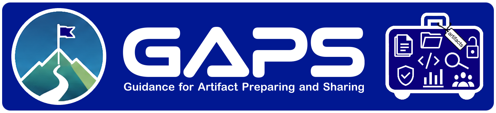

<div align="center"><nobr>

[Home](../home.md) &nbsp;&nbsp;&nbsp;&nbsp; | &nbsp;&nbsp;&nbsp;&nbsp; 
[GAPS structure](../content/structure.md) &nbsp;&nbsp;&nbsp;&nbsp; | &nbsp;&nbsp;&nbsp;&nbsp; 
[Complementary resources](../content/complementary-resources.md)

</nobr></div>

---



## GAPS - Guidance for Artifact Preparation and Sharing

Version: 2.0
- GAPS Material: [https://gaps-material.netlify.app/](https://gaps-material.netlify.app/)
- GAPS Advisor: [https://notebook.google.com/notebook/17518b1f-e320-48be-a9c2-0edee13c6737](https://notebook.google.com/notebook/17518b1f-e320-48be-a9c2-0edee13c6737)


## Purpose of the GAPS

GAPS (Guidance for Artifact Preparation and Sharing) is an educational resource designed to support researchers in the preparation, documentation, and sharing of research artifacts, particularly in Empirical Software Engineering.

The guidance provided in this document is not intended to be exhaustive. Instead, it offers practical recommendations based on survey responses, the literature, and existing guidelines, including materials suggested by survey participants.

Overall, GAPS serves as a practical tool to help researchers identify and prioritize key aspects when preparing research artifacts.

## GAPS Material

GAPS is organized into ten modules covering the main aspects of research artifact preparation and sharing. The modules are organized by topic rather than as a mandatory sequence. Researchers may consult different modules depending on their artifact, needs, and stage of development.

- **Module 1 - Foundations**: Introduces Open Science and research artifacts, establishing the conceptual foundations for artifact preparation and sharing. It covers artifact types, FAIR principles, artifact characteristics, and the artifact lifecycle.
  
- **Module 2 - Planning and artifact organization**: Guides researchers in planning artifact sharing from the early stages of the research process. It covers artifact-oriented workflows, file and repository organization, naming and file formats, and data organization.
  
- **Module 3 - Documentation**: Explains how to document artifacts so that others can understand, execute, and reuse them. It covers operational, structural, and scientific documentation, README files, limitations, and complementary documentation.
  
- **Module 4 - Environments, dependencies, and automation**: Addresses the technical conditions needed to execute artifacts reliably and reproducibly. It covers dependencies, environment isolation and portability, scripts and workflow automation, version control, and common pitfalls.
  
- **Module 5 - Data, privacy, and ethics**: Guides researchers in handling data responsibly when preparing artifacts for sharing. It covers legal and ethical considerations, sensitive data, anonymization, and strategies for sharing restricted data.
  
- **Module 6 - Validation and pre-release preparation**: Helps researchers assess whether an artifact is ready to be shared. It covers artifact validation, result variability and limitations, final inspection, and pre-release preparation.
  
- **Module 7 - Publishing, licensing, and citation**: Guides researchers in preparing and publishing artifacts. It covers repository selection, artifact packaging, licensing, persistent identifiers and citation metadata, Data Availability Statements, and publication visibility.
  
- **Module 8 - Preservation, versioning, and maintenance**: Addresses the long-term availability and sustainability of research artifacts. It covers artifact decay, versioning and changelogs, preservation, and maintenance after publication.
  
- **Module 9 - Reusability and extension**: Focuses on enabling others to reuse and extend research artifacts. It covers reusable design, adaptation to new inputs, reusable components, limitations, and extension scenarios.
  
- **Module 10 - Artifact evaluation and submission**: Introduces the artifact evaluation and submission process. It covers reviewer access, artifact evaluation criteria, badges, preparation for evaluation, versioning during review, and interaction with reviewers.

### Complementary Resources

GAPS is accompanied by complementary resources designed to support researchers in applying the guidance:

- **GAPS Advisor**: An AI-based advisor that uses GAPS as its primary guidance to provide contextualized recommendations during artifact preparation and sharing.

- **Researcher-facing self-check**: A concise checklist that researchers can use to perform a final high-level check of their artifact before sharing.

- **README template**: A template to help researchers create a clear and consistent README for their research artifacts.

- **GAPS References**: The references cited throughout GAPS, provided for consultation and further reading.

## Sources

The content of GAPS was developed from a synthesis of the needs and practices identified in the survey, complemented by relevant guidelines, standards, and research literature, including materials suggested by survey participants.

We have made every effort to properly acknowledge all sources. If any attribution has been omitted unintentionally, we welcome feedback and will be happy to make the necessary corrections.

## Authors

[**Ana Paula Vasconcelos**](https://orcid.org/0000-0002-2513-4924) is a Ph.D. student at the Centro de Informática of the Universidade Federal de Pernambuco (CIn/UFPE) and a Technical Staff Member at the Universidade do Estado de Mato Grosso (UNEMAT), Brazil. Her research interests include Open Science and research artifacts, focusing on education and training.

[**Fernanda Madeiral**](https://orcid.org/0000-0003-2048-7648) is an Assistant Professor at the Centro de Informática of the Universidade Federal de Pernambuc (CIn/UFPE), Brazil. Her broad research goal is to help developers produce and maintain high-quality software systems. Her research interests include software bugs and their fixes, linter violations, and source code understandability. She is also an Advocate of Open Science.

[**Sergio Soares**](https://orcid.org/0000-0002-4428-2535) is an Associate Professor at the Centro de Informática of the Universidade Federal de Pernambuco (CIn/UFPE), one of Brazil's top Computer Science academic groups. He has experience in coordinating industry research, development, and innovation projects. He works on software engineering, mainly in experimental Software Engineering, data protection and privacy, Open Science, smart cities, knowledge management, and digital health.

## How to cite this material

Citation metadata is also available in the [`CITATION.cff`](/CITATION.cff) file for tools that support it. The formats below are provided for convenience.

### BibTeX

```bibtex
@misc{VasconcelosMadeiralSoares2026,
  author    = {Ana Paula Vasconcelos and
               Fernanda Madeiral and
               Sergio Soares},
  title     = {GAPS - Guidance for Artifact Preparation and Sharing},
  year      = {2026},
  publisher = {Zenodo},
  version   = {v2.0},
  doi       = {10.5281/zenodo.23074677},
  url       = {https://github.com/anapvasconcelos/gaps}
}
```

### Plain text

```
Vasconcelos, Ana Paula, Madeiral, Fernanda, and Soares, Sergio. (2026). GAPS - Guidance for Artifact Preparation and Sharing. DOI: 10.5281/zenodo.23074677. Available at: https://github.com/anapvasconcelos/gaps
```

## License and use

The Guidance for Artifact Preparation and Sharing (GAPS) is released as an Open Educational Resource under the Creative Commons Attribution-ShareAlike 4.0 International License ([CC BY-SA 4.0](/LICENSE)).

This means that the content can be freely reused, adapted, and redistributed, including for commercial purposes, provided that appropriate credit is given and that any derivative works are distributed under the same license.

This material includes adapted content from sources licensed under CC BY-SA 4.0. Therefore, this license is used to comply with ShareAlike requirements from these sources.

To view a copy of this license, visit [https://creativecommons.org/licenses/by-sa/4.0/](https://creativecommons.org/licenses/by-sa/4.0/).


---

GAPS - Guidance for Artifact Preparation and Sharing © 2026 by Ana Paula Vasconcelos, Fernanda Madeiral, and Sergio Soares is licensed under CC BY-SA 4.0.